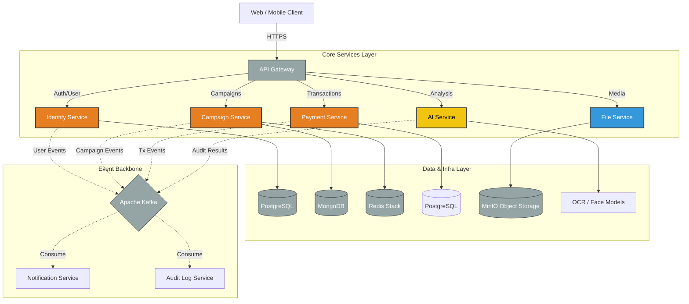

# Tâm Sáng (Tam Sang Charity Ecosystem)


[](https://www.java.com/)
[](https://go.dev/)
[](https://www.python.org/)
[](https://nextjs.org/)
[](https://www.docker.com/)
[](LICENSE)

## 🌟 Introduction

**Trust is the currency of charity.** In an era where skepticism hinders generosity, **Tâm Sáng** restores faith through radical transparency and technology. 

We are building a decentralized, transparent charity platform that leverages **Real-time Auditing**, **AI-assisted Verification**, and **Legally Binding** workflows to ensure every donation reaches its intended destination. By combining the robustness of Java enterprise systems, the performance of Go, and the intelligence of Python AI agents, Tâm Sáng creates an immutable chain of trust from donor to beneficiary.

---

## 🏗️ System Architecture

Tâm Sáng utilizes a **Polyglot Microservices Architecture** to leverage the best tool for each specific domain. The system is event-driven, ensuring high scalability and decoupled interactions.



### Technical Highlights

*   **⚡ High-Performance File Uploads (Presigned URLs):** To minimize load on our backend, the **File Service (Go)** generates secure, time-limited Presigned URLs via MinIO. Clients upload large evidence files directly to object storage, ensuring low latency and scalability.
*   **🔄 Event-Driven Architecture:** We rely on **Apache Kafka** for asynchronous communication between services. This decouple critical flows like "Campaign Created" triggering "AI Audit" or "Donation Received" triggering "Real-time Statement Updates," ensuring system improved resilience and responsiveness.

---

## 🚀 Key Features

### 🛡️ Identity & Security
*   **eKYC Verification:** Integration of **Face Matching** and liveness detection to verify user identity against government-issued IDs.
*   **Online Contracts:** legally binding digital agreements between campaigners and the platform.
*   **Blacklist System:** Automated detection and blocking of fraudulent actors.

### 💰 Transparent Finance
*   **Dedicated Wallets:** Unique banking identifiers for each campaign to prevent fund commingling.
*   **Real-time Statements:** Instant public visualization of all incoming donations and outgoing withdrawals.
*   **Multi-tier Withdrawal:** 
    *   *Standard:* Requires full invoice, audit approval.
    *   *Emergency:* Restricted, fast-track flow for urgent needs.

### 🤖 AI Agent & Automation
*   **Fraud Detection:** Analysis of campaign evidence images to detect Photoshop/manipulation.
*   **Smart OCR:** Automated extraction of data from invoices and receipts.
*   **Context Verification:** Comparison of invoice line items against the campaign's stated purpose (e.g., flagging "Beer" in a "School Supplies" campaign).

### 🔄 Human-in-the-Loop Workflow
1.  **Submission:** Campaigner submits request/evidence.
2.  **AI Audit:** System performs preliminary checks (OCR, Fraud detection).
3.  **Human Review:** Admins make final decisions based on AI recommendations.

---

## 💻 Tech Stack

| Domain | Technology | Description |
| :--- | :--- | :--- |
| **Frontend** |    | App Router, Shadcn/ui (Purple Theme), Zustand, Radix UI. |
| **Identity Service** |  | User Management, OAuth2/JWT Orchestrator. |
| **Campaign Service** |    | Campaign Logic, RediSearch for high-speed definition. |
| **Payment Service** |   | Transaction Ledger, Wallet Management. |
| **File Service** |   | **Presigned URL** generation, Media Management. |
| **AI Service** |   | OCR (Tesseract/Google Vision), OpenCV, PyTorch. |
| **Infrastructure** |   | Containerization, Event Streaming. |

---

## 🛠️ Getting Started

Follow these steps to set up the development environment locally.

### Prerequisites
*   **Docker Desktop** (running)
*   **Java 21 (JDK)**
*   **Go 1.22+**
*   **Python 3.11+**
*   **Node.js 20+**

### Installation

1.  **Clone the Repository**
    ```bash
    git clone https://github.com/your-org/tam-sang-ecosystem.git
    cd tam-sang-ecosystem
    ```

2.  **Start Infrastructure**
    Launch the core infrastructure (Databases, Broker, Cache) in detached mode:
    ```bash
    docker-compose up -d
    ```

3.  **Run Microservices** (Terminal multiplexer or separate tabs recommended)
    
    *   **Identity Service:**
        ```bash
        cd identity-service && ./mvnw spring-boot:run
        ```
    *   **Campaign Service:**
        ```bash
        cd campaign-service && ./mvnw spring-boot:run
        ```
    *   **File Service:**
        ```bash
        cd file-service && go run main.go
        ```
    *   **AI Service:**
        ```bash
        cd ai-service && uvicorn app.main:app --reload
        ```

4.  **Run Frontend**
    ```bash
    cd fe/tam-sang-frontend
    npm install
    npm run dev
    ```

Access the application at `http://localhost:3000`.

---

## 📱 Screenshots

| Landing Page | Campaign Dashboard | Mobile View |
|:---:|:---:|:---:|
|  |  |  |

---

## 🗺️ Roadmap

- [ ] **Phase 1:** Core Campaign & Donation Flow (MVP)
- [ ] **Phase 2:** AI Agent integration for automatic receipt parsing
- [ ] **Phase 3:** Blockchain integration for immutable audit logs (Hyperledger/Ethereum)
- [ ] **Phase 4:** Mobile App (React Native/Flutter)

---

## 📄 License

This project is licensed under the MIT License - see the [LICENSE](LICENSE) file for details.

## 👥 Author

**Capstone Team**  
*Lead Maintainer:* [Your Name]

---

*Built with ❤️ for a better, more transparent world.*
